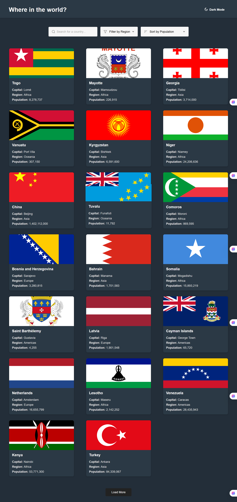

# 🌍 REST Countries Explorer

A responsive web app to explore and learn about countries using the [REST Countries API](https://restcountries.com/). Built as a Frontend Mentor challenge.

---

## 📑 Table of Contents

- [Overview](#overview)
  - [The Challenge](#the-challenge)
  - [Screenshot](#screenshot)
  - [Links](#links)
  - [Built With](#built-with)
  - [What I Learned](#what-i-learned)
  - [Useful Resources](#useful-resources)
- [Features](#features)
- [How to Run](#how-to-run)
- [File Structure](#file-structure)
- [Customization & Tweaks](#customization--tweaks)
- [Notes](#notes)
- [Credits](#credits)
- [Author](#author)
- [Acknowledgments](#acknowledgments)

---

## 📌 Overview

### 🎯 The Challenge

Users should be able to:

- ✅ See all countries from the API on the homepage  
- 🔍 Search for a country using an `input` field  
- 🌍 Filter countries by region  
- 📄 Click on a country to view more detailed information on a separate page  
- 🔁 Click through to the border countries on the detail page  
- 🌗 Toggle between light and dark mode *(optional)*

---

### 📸 Screenshot

---

### 🔗 Links

- **Live Site:** [Countries API](https://countries-project-ruddy.vercel.app/index.html)  
- **Solution URL:** [My Country API project](https://https://countries-project-ruddy.vercel.app/index.html.com)

---

### 🛠 Built With

- Semantic **HTML5** Markup  
- **CSS Custom Properties**  
- **Flexbox** & **CSS Grid**  
- **Vanilla JavaScript**  
- **Mobile-first** workflow

---

### 📚 What I Learned

- How to fetch data from the REST Countries API  
- Implementing pagination logic  
- New filtering methods using JavaScript  
- Structuring a multi-page UI  
- Improving app accessibility and responsiveness

---

### 📖 Useful Resources

- [REST Countries API](https://restcountries.com/)
- [Frontend Mentor](https://www.frontendmentor.io/)
- `ChatGPT` – For learning about pagination and generating template code

---

## 🚀 Features

- Display all countries on the homepage  
- Search countries by name  
- Filter countries by region  
- Sort countries by population (ascending/descending)  
- Load more countries with pagination  
- View detailed country information in a modal/page  
- Click on border countries to view neighbors  
- Toggle between light and dark mode (remembers your choice)  
- Fully responsive design (desktop and mobile friendly)

---

## 🧪 How to Run

To run the project locally:

1. Download or clone this repository.
2. Open `index.html` in your browser. *(No build step is required.)*

---

## 📁 File Structure
├── index.html # Main HTML file (homepage)
├── country-detail.html # Country details page
├── script.js # Handles fetch, filters, sort, modal & pagination
├── country-detail.js # Logic for details page
├── style.css # Global styles with light/dark mode
└── screenshot.png # App preview

---

## ⚙️ Customization & Tweaks

- **Countries per page:** Edit `PAGE_SIZE` in `script.js`
- **Extra fields:** Update API query and rendering logic in `script.js`
- **Styling:** Modify colors, fonts, and layout in `style.css`

---

## 📝 Notes

- Data is fetched live from the REST Countries API
- No frameworks or build tools required
- All interactive elements are **keyboard and screen reader friendly**

---

## 🎨 Credits

- Challenge by [Inventors Community](https://inventors.com)  
- Data from [REST Countries API](https://restcountries.com)

---

## 👤 Author

**Nifemi Bello**  
- LinkedIn – [NifemiBello](https://www.linkedin.com/in/nifemi-bello)  

---

## 🙌 Acknowledgments

Special thanks to:

- `ChatGPT` – For assisting with concepts like pagination and generating helpful code snippets.
